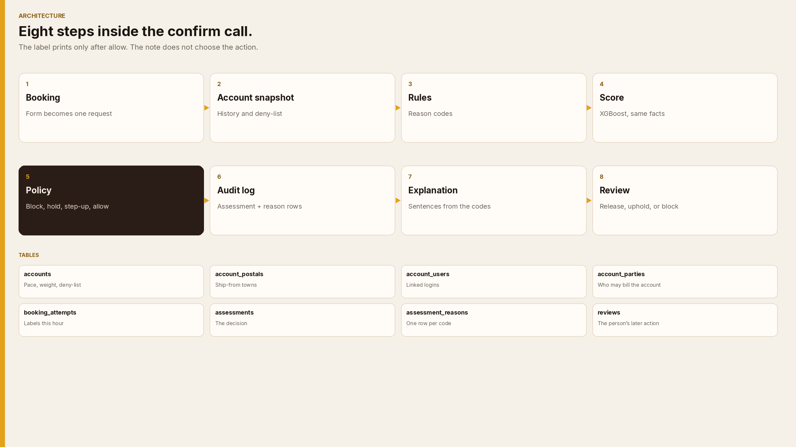

# Architecture



The confirm screen asks one question: may this booking print a label on this account’s credit?

The work is split into eight steps. Steps 1–7 run on every confirm. Step 8 is the reviewer, after the decision is stored. The language model is not one of these steps. It may rewrite the note later. It does not choose allow, hold, or block.

```
Confirm screen
    → 1. Booking contract          the form becomes one request, id = tx
    → 2. Account snapshot          Mehta’s history, deny-list, linked login
    → 3. Rules                     five reason codes, plus closed / thin history
    → 4. Score                     XGBoost on the same facts
    → 5. Policy                    block > hold > step-up > allow
    → 6. Audit log                 one assessment row + one row per reason code
    → 7. Explanation               sentences that cite those codes
    → 8. Review                    a person releases, upholds, or blocks
```

Only an **allow** with no open review would go on to payment capture and the 1Z. This prototype stops at the decision. It does not call UPS.

## Step 1 — Booking contract

`POST /v1/booking-risk`

The body is the confirm form: who is logged in, guest or not, card or account, billed account, shipper account, from and to postal code and country, weight, service. `tx` is the booking-session id. Sending the same `tx` again returns the first decision and does not count a second attempt.

A card payment is stored and allowed through. It does not read Mehta’s credit.

## Step 2 — Account snapshot

Loaded from the account tables, not from the request. The booker cannot send their own “weekly pace.”

For Mehta (`9A4K2M`) the snapshot is: open, denies third-party billing, linked login `mehta.ops`, ship-from `400001`, domestic ground, about 6 parcels a week, median 8 kg, 80 shipments in 90 days.

No row for that account number means the master data does not know it. The decision is step-up, code `ACCOUNT_UNKNOWN`.

## Step 3 — Rules

Pure function in `backend/app/domain.py`. Same inputs always produce the same codes.

| Code | Action |
| --- | --- |
| `ACCOUNT_CLOSED` | Block |
| `INBOUND_POLICY_DENY` | Block |
| `NEW_PAYER_RELATIONSHIP` | Hold |
| `ORIGIN_LANE_SHIFT` | Hold |
| `VELOCITY_SPIKE` | Hold |
| `UNLINKED_ACCOUNT_ON_GUEST` | Step-up |
| `THIN_HISTORY` | Step-up |
| `CARD_PAYMENT_OUT_OF_SCOPE` | Allow |

Hourly pace is `booking_attempts` in the last hour, plus this attempt.

## Step 4 — Score

XGBoost reads the same feature vector the rules just built. The model file is trained on sample rows until real “I did not ship this” disputes exist. `backend/data/fraud_model.json` stores the hold threshold.

## Step 5 — Policy

Rules set the action. A score at or above the threshold can move an **allow** to **hold** and add `MODEL_ELEVATED_SCORE`. A score never blocks. Thin history and card payments skip the model.

## Step 6 — Audit log

One `assessments` row is the decision. `assessment_reasons` is one row per code, in order. `booking_attempts` is the pace counter. The feature vector is stored on the assessment so a later dispute can be joined back to the same `tx`.

## Step 7 — Explanation

Sentences are filled from the codes and the snapshot facts (name, weekly pace, median weight, attempts this hour). `explanation_source` is `rules`. If `OPENAI_API_KEY` is set, GPT-4.1 mini may rewrite the wording. The stored action and codes stay as the policy wrote them.

## Step 8 — Review

`POST /v1/decisions/{tx_id}/review` with `release`, `uphold`, or `block`, plus a reviewer name. The original assessment is not edited. The review is a new row. The queue shows the latest review beside the original decision.

## Schema

Postgres-shaped DDL is in [schema.sql](schema.sql). The running app creates the same tables through SQLAlchemy on SQLite (`backend/data/prototype.db`). Set `DATABASE_URL` for Postgres.

| Table | Holds |
| --- | --- |
| `accounts` | Status, inbound policy, pace, median weight, 90-day count |
| `account_postals` | Ship-from footprint |
| `account_users` | Logins linked to the account |
| `account_parties` | Exception list (`exception`) and shippers who have billed this account before (`known_payer`) |
| `booking_attempts` | One row per confirm on that account, for the hourly burst rule |
| `assessments` | The decision, score, note, and the booking columns |
| `assessment_reasons` | Reason codes for that decision |
| `reviews` | A person’s later release, uphold, or block |

## Not in this step

A live UPS confirm call, real invoices as training labels, the postal-code and invoice step-up form, card-network checks, and a rupee dashboard.
